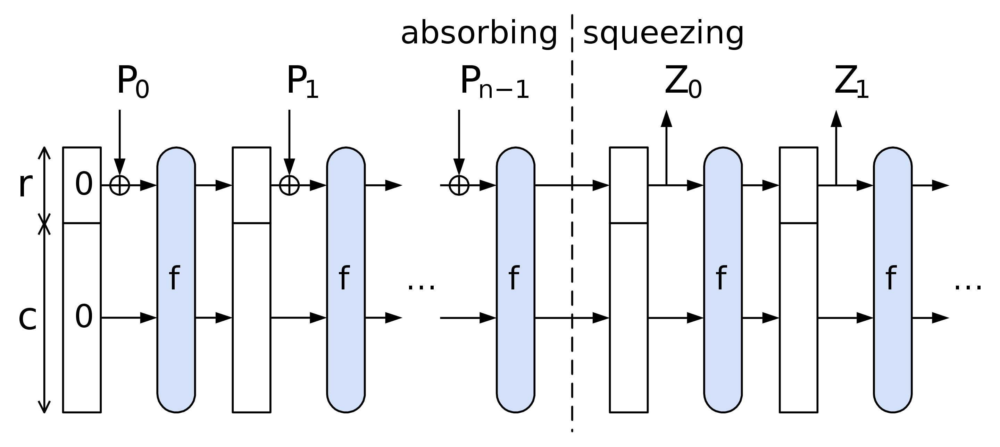

# Sponge
Sponges are used in cryptography to absorb data of any size and produce a fixed-size output. 
They are used in hash functions, pseudo-random number generators, stream ciphers, and authenticated encryption schemes.
More can be found at this [link](https://en.wikipedia.org/wiki/Sponge_function).

## Why we call it a sponge

**The Sponge (State) Idea:**
Think of the sponge as having two action: it first absorbs input data like a sponge absorbs liquid, and subsequently this data gets squeezed to produce output data like a sponge releases liquid. 
In cryptographic terms, this sponge is the internal **state** of the hash function.

1. **Absorbing Phase:**
   - Data such as a message, a file, or a number is divided into blocks, for instance, of a given number of bits or the size of a finite field.
   - Each block of your input data is "absorbed" into the sponge where it is then mixed with the residual data (like the residual "liquid") in the sponge. 
   The absorption and mixing process are defined concretely by the rate and capacity of the sponge respectively.
   This mixing process can be thought of like absorbing some new blue colored water into one chunk of the sponge and some new red in another while there is already some green soaking in the rest of the sponge. 
   Fitting to the analogy, to truly mix these, the sponge would be allowed to sit where diffusion of the colors would occur.
   In the cryptographic case, we use a permutation to mix the data like diffusion can mix the colors.

2. **Squeezing Phase:**
   - Once the sponge has absorbed all your data (or all the colored water in the analogy), it's time to get the hash output, similar to squeezing water out of the sponge.
   - In the squeezing phase, part of the sponge's state is read out as the hash result. 
   If the desired hash output is longer, the sponge might be "squeezed" multiple times, with additional transformations in between to ensure security.
   If it is shorter, the sponge is squeezed only once, and the output is truncated to the desired length.
   By squeezing the sponge, we are essentially wringing out the water, leaving us with a fixed amount of water (the hash) that is a mix of all the colors (the input data).
   The blue, red, and green water in our analogy now becomes a single murky brownish purplish color, which is the hash output.
   Could you ever get the original colors back from this let alone the order they were added in?

### Why are sponges convenient?

1. **Flexibility with Input Sizes:**
   - The sponge construction can handle input data of any size. 
   It absorbs data block by block until all data is processed.

2. **Fixed Output Size:**
   - The hash function produces outputs of a fixed size, regardless of the input size.

3. **Security:**
   - The mixing and transformation processes in the sponge ensure that even a small change in the input (like adding a drop of differently colored water) leads to a completely different and unpredictable output, which is a crucial aspect of secure hash functions.

## Sponge Construction
The [Wikipedia: Sponge function article](https://en.wikipedia.org/wiki/Sponge_function) breaks down the sponge nicely, but it does so for sponges that absorb bits rather than elements of a finite field.
From this reference and the [Poseidon paper](https://eprint.iacr.org/2019/458.pdf), we can outline the sponge used in Poseidon making the necessary changes in terminology and notation.

The sponge construction is defined by the following parameters:
- The size of the *chunks* which are the elements of the finite field $\mathbb{F}_q$;
- The size of the state $S$ which is the number of chunks in the sponge;
   - The rate $r$ which is the number of chunks absorbed in each step;
   - The capacity $c$ which is the number of chunks stored in the sponge in each step;
   - Note that at any given point in the process, we have $S = r + c$.
- A function $f \colon \mathbb{F}_q^S \to \mathbb{F}_q^S$ which is the permutation applied to the sponge, which for Poseidon is a combination of S-Boxes and linear layers;
   - The rate can then be described via the `bits/perm` ratio which is the number of bits in the state divided by the number of bits in the permutation.
- A padding function $P$ to pad the input to the sponge to a multiple of $r$ chunks as needed.

For Poseidon in particular, we will follow this flow:
1. Determine the capacity element value and the input padding if needed. 
2. Split the obtained input into chunks of size r. 
3. Apply the permutation Poseidon permuation $\pi$ (our $f$ above, essentially) to the capacity element and the first chunk. 
4. Until no more chunks are left, add them into the state and apply the permutation. 
5. Output $o$ output elements out of the rate part of the state. If needed, iterate the permutation more times.

Looking at this diagramatically, we have the following:

TODO: It seems like the chunks are actually of size $r$ not $q$ from the field. 
